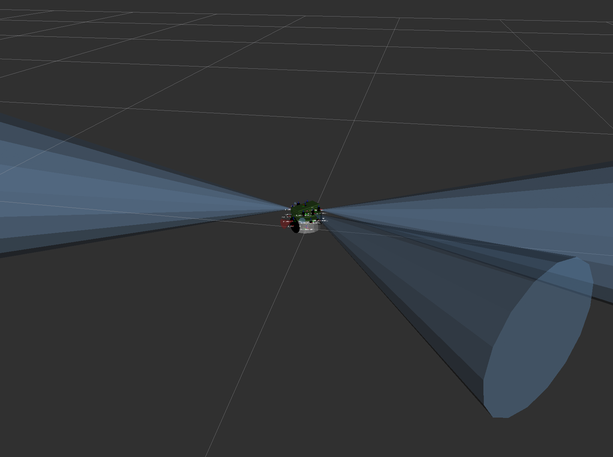

# Pi-puck ROS Driver Package

## Introduction

This repository contains the ROS driver package for support for the Pi-puck robotics platform.

### Pi-puck

The Pi-puck is a [Raspberry Pi](https://www.raspberrypi.org) extension board for the [e-puck](http://www.gctronic.com/doc/index.php?title=E-Puck) and [e-puck2](http://www.gctronic.com/doc/index.php?title=e-puck2) robot platforms, designed and built as a collaboration between the [University of York](https://www.york.ac.uk/robot-lab/) and [GCtronic](http://www.gctronic.com).

For more information about the Pi-puck, see:
- GCtronic wiki page - http://www.gctronic.com/doc/index.php?title=Pi-puck
- Pi-puck on the YRL website - https://www.york.ac.uk/robot-lab/pi-puck/
- IROS 2017 paper - https://eprints.whiterose.ac.uk/120310/

## Supported Features

This package has only been tested with ROS Melodic.

The following features are currently supported:

- [x] Navigation
  - [x] Spatial
    - [x] IMU (Z-rotation mode and full 3-axis mode)
    - [ ] Accelerometer (Not exposed by Pi-puck e-puck firmware, changes to firmware needed if we want to expose this)
    - [x] Transform server
      - [x] Static transforms
      - [x] Dynamic transform
        - [x] Rotation
        - [x] Translation
  - [x] Motors
    - [x] Speed
    - [x] Steps 
    - [x] Odometry
  - [x] Proximity
    - [x] e-puck IR (< 1 metre range)
    - [x] Pi-puck IR (between 1.35 and 4 metre range based on mode)
- [ ] Vision
  - [ ] e-puck camera
  - [ ] Pi-puck camera 
- [ ] Sound
  - [ ] Speaker
  - [ ] Microphones
- [x] Power
  - [x] Battery ADC
- [x] Display
  - [x] OLED
- [ ] I/O
  - [ ] Navigation switch

## Documentation

For full documentation see the repository [Wiki](./../../wiki).

## Robot Model (URDF)

A model of the Pi-puck can be found in `src/pi_puck_driver/src/urdf/pi_puck_urdf.xml`. 

## RVIZ

RVIZ configuration displaying data from all sensors of the Pi-puck can be found in `src/pi_puck_driver/src/rviz/pi_puck.rviz`.
